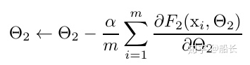
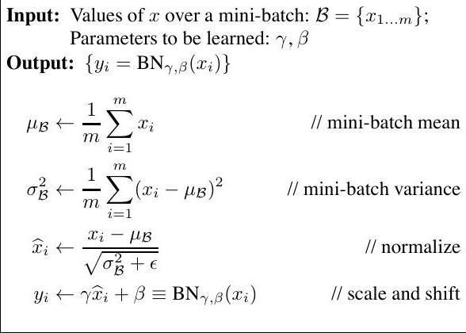
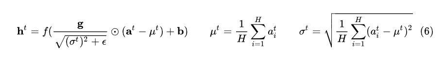
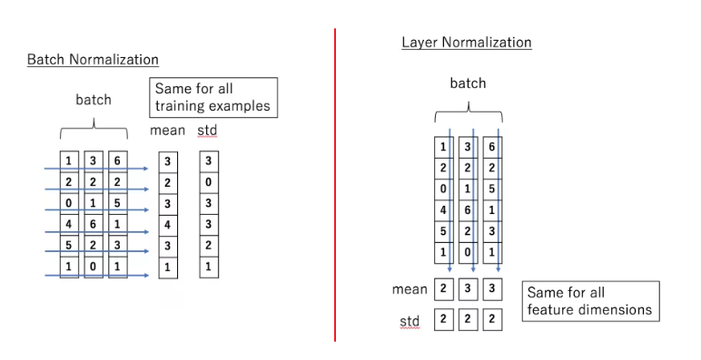

# BatchNorm-LayerNorm
- [BatchNorm-LayerNorm](#batchnorm-layernorm)
  - [实际使用](#实际使用)
    - [batchnorm](#batchnorm)
  - [batch norm-理论](#batch-norm-理论)
    - [batch normalization产生时的问题背景](#batch-normalization产生时的问题背景)
      - [内部协变量漂移：](#内部协变量漂移)
        - [梯度消失](#梯度消失)
      - [batch normalization的原理](#batch-normalization的原理)
      - [batch normalization的作用](#batch-normalization的作用)
      - [batch normalization不好用的场景](#batch-normalization不好用的场景)
    - [layer norm-理论](#layer-norm-理论)
    - [batch norm vs. layer norm](#batch-norm-vs-layer-norm)

## 实际使用
### batchnorm
**在实际使用中，batchnorm的参数有running_mean，running_var，beta(shift)，gamma(scale)四个可以调整的参数。**  
由于batchnorm是在不同样本间的同一个特征进行处理，对于一个特征[batch, hidden]而言，上述四个参数的维度都是[hidden]，因为对于每个维度而言，都有一个均值、方差、偏移、扩张。  
beta的初始值为0，代表没有shift；gamma的初始值为1.0，代表不进行scale。

## batch norm-理论
### batch normalization产生时的问题背景
#### 内部协变量漂移：
在机器学习中 **假设源空间(source domain)和目标空间(target domain)的分布是一致的**  
协变量漂移属于分布不一致的情况 它指的是**源空间和目标空间的条件分布一样 但是边缘分布不一样** 即所有样本 P_s(Y|X=x) = P_t(Y|X=x) 但是P_s(X) != P_t(X)  
假设某个网络有多层l = F2(F1(u,θ1), θ2) 如果令网络的第一层的输出是x = F1(u,θ1) 这样l = F2(x,θ2)  
在用梯度下降优化第二层网络参数θ2时 参数更新规则为:  
  
**这样每次更新θ1的时候 都会导致x发生变化** 因为x = F1(u,θ1) θ1改变x就会改变 在层之间x每一层都发生了变化 但是总体网络的输入和输出P_s(Y|X=x) = P_t(Y|X=x)不变  
当网络层数深了的时候 这种变化不断叠加 就是内部协变量漂移 之所以叫内部 就是因为这是层间信号的情况  
如果在层和层之间**x的分布相对比较稳定**的话 优化起来更优效率 此时在本层优化时就不用补偿因为上一层的变化导致的x分布的变化 只用优化该层即可  
##### 梯度消失
另外 当使用sigmoid等激活函数的时候 随着梯度加深 输入值可能偏移到两端 即梯度特别小的地方(梯度消失现象) 这样就会导致网络收敛速度变得特别慢  

#### batch normalization的原理
  
1. 计算当前mini-batch所有样本均值
2. 计算当前mini-batch所有样本方差
3. 对当前mini-batch中每个样本用1.2.中的均值方差做归一化
4. 对归一化的样本 乘以一个放缩系数 再做一个平移
放缩系数和平移系数都是要学习的参数  

1.2.3都是为了稳定x的分布 缓解上述问题  
第四步的作用是防止过度限制模型表达能力 使得BN层的输出有重构原来没有经过处理的能力  
举例来说 上一层的优化对X产生了影响 假设该影响就是要将数据分布在0-1的两边 sigmoid就是不好处理了 仅仅使用1.2.3步时 将分布强行拉回中间 为了梯度更好  
但是这就破坏了上一层的学习效果 得不偿失  所以第四步的作用就是为了缓解对上一层效果的限制 当然缓解多少是通过学习得到的  

#### batch normalization的作用
1. 加速训练 **网络不必考虑上一次迭代所导致的分布的变化**  
其次 **可以选择较大的学习率** 减轻梯度爆炸和梯度消失情况 减少训练时对careful weight initialization依赖  
2. 正则化功能 提高泛化能力 减少对dropout和l2的依赖
3. 网络可以采用非线性饱和特性的激活函数 如sigmoid 而不是局限于relu 因为不会发生明显的梯度消失现象

1.3在问题中已经描述过了  
2.是因为在使用BN训练时 一个样本只和其他样本有相互关系 对于同一个训练样本 当其与不同的batch采样进行norm后 网络输出会发生变化 这就提高了泛化能力  

#### batch normalization不好用的场景  
1. 由于硬件限制 每个batch尺寸比较小时 谨慎使用BN (因为BN是按照样本数归一化的 当样本数很少的时候 少量样本并不能反映整体均值方差 用这些均值方差归一化 数据会变得很奇怪 导致效果变得很差)
2. 类似于RNN的动态网络中谨慎使用BN  (RNN在一个batch中 各个样本的长度可能都是不一样的 seq_len的问题 那么在某些seq_len上 部分样本才有值 那么就回到1.中的问题 少量样本不能代表分布)  
(当测试数据比训练数据还长时 如NLP问题中 测试句子长度比所有训练样本还长 由于**batch norm的归一化两个参数是在训练中学习的 是对于每个xi都有一组参数** 而这些参数最多就是训练集的句子最长的值  
那么 当测试数据比训练数据多的时候 找不到训练过程得到的存储好的参数对 就无法往下做了)
3. 训练数据集和测试数据集方差较大的时候

### layer norm-理论
由于batch norm中的不好用的场景 Layer norm 对其加以改进  
layer norm是独立于batch_size的做法 无论样本数多少都不会影响layer norm的计算  
简而言之 layer norm是**根据特征数做归一化**  
在图像问题上 layer norm对一整张图片进行标准化处理 即在一张图片所有channel的像素范围内计算均值和方差  
在NLP问题中 layer norm对一个句子的token内部做标准化 也就是在[batch_size, seq_len, feature] 中的feature维度做归一化  
**在transformer中是对seq_len * feature这个维度做归一化 即将句子中所有词一起做归一化**  
  
过程和batch norm基本一样 就是计算的维度不同  
1. 计算feature维度上的均值
2. 计算feature维度上的方差
3. 按照1.2.中的均值方差归一化
4. 加上增益和偏置(原因和batch norm相同)

### batch norm vs. layer norm
batch norm 和 layer norm是非常近似的一种归一化方法  
不同点在于batch norm取的是不同样本的一个特征 layer norm取的是同一个样本的不同特征(或者是所有特征)  
在batch norm 和 layer norm都可以使用的场景中 batch norm的效果一般优于 layer norm  
原因在于基于不同的数据 同一特征得到的归一化结果更不容易损失信息 而同一个样本间的不同特征归一化直觉上有些奇怪  
  
但是有些场景是不能使用batch norm的 见**batch normalization不好用的场景**  
这时候使用layer norm 得到模型更稳定且具有正则化的效果  
  
Batch Normalization 它**去除了同一样本间不同特征之间的大小关系 但是保留了不同样本间同一特征的大小关系** 所以在CV领域用的多  
比如样本有两个feature, 样本1(2,3) 样本2(100,-3) 那么batch norm之后2和100的大小关系继续存在 3和-3的大小关系继续存在 但是(2,3)的大小关系不存在了 舍弃了同一个样本不同特征之间的大小关系 保留了不同样本间 同一特征的大小关系   
Layer Normalization 它**去除了不同样本间同一特征的大小关系 但是保留了一个样本内不同特征之间的大小关系** 所以在NLP领域用的多  
仍然以样本有两个feature, 样本1(2,3) 样本2(100,4) 举例 layer norm之后样本1第二维大于0 样本2第二维小于0 本身样本1第二维小于样本2第二维 现在样本1第二维大于样本2第二维 所以丢弃了不同样本间同一特征的大小关系 但是保留了同一个样本间2小于3 100大于4的关系  
  

一般而言 Batch Normalization层在Conv层或全连接层之后 而在ReLU等激活层之前 而对于 dropout 则应当置于 activation layer 之后  