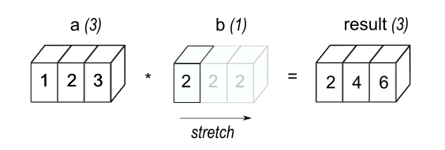
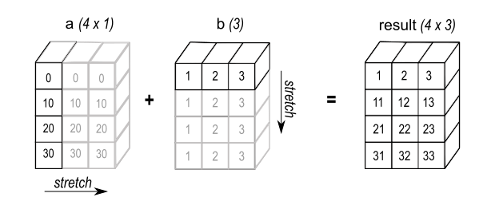

# 矩阵/张量的广播
矩阵/张量的广播功能被广泛应用在numpy、pytorch等库中。  
广播是在两个矩阵运算期间，试图将不同维度的数组进行算术运算的方法，在某些条件的限制下，将较小的矩阵进行“广播”，从而对二者进行计算。  
广播过程无需复杂地将原始维度较小的向量或标量扩展为与维度较大的相同的矩阵，而是往往采用更为高效的策略进行处理。  
参考文档:  
[numpy广播文档](https://numpy.org/doc/stable/user/basics.broadcasting.html)  
[pytorch广播文档](https://pytorch.org/docs/stable/notes/broadcasting.html)
## 广播的基本理解
```python
import numpy as np
a = np.array([1.0, 2.0, 3.0])
b = 2.0
c = a*b # 可以执行 使用了广播机制
```
上述代码中，一个维度为(3,)的a和一个标量b进行点积计算，通过广播机制将2.0扩展为了维度为(3,)的向量，并与a完成了点积。  
过程图示如下：  

## 广播的基本要求
在两个张量进行计算时，广播函数从两个张量的维度最右侧向左看，二者的维度必须满足两个条件之一：  
1. 二者维度相同；
2. 不同时，一方为1

需要注意的是，在广播时两个张量的维度不一定要相同，**从右向左看时若有一方缺失，则补充为1，继续进行上述过程**。  
例如：  
有一个256,256,3的图像，为RGB三个通道乘以不同的值。  
```
Image shape: (256, 256, 3)
Scale shape: (3,) 如[1.0 ,2.0, 3.0]
广播过程从右向左对比，3=3，之后scale缺失则补1，满足广播规则。
最终生成的矩阵维度为(256, 256, 3)
```
另外，**最终计算得到的张量，每一维为二者的最大值一方**。  
例如：  
```
A shape: (8, 1, 6, 1)
B shape: (   7, 1, 5)
对二者进行广播，从右向左看每次都是一方为1，另一方有值，则满足广播规则。
最终生成的矩阵维度为(8, 7, 6, 5) 每次选择二者更大的一方
```

```python
import numpy as np
a = np.array([0.0, 10.0, 20.0, 30.0])
b = np.array([1.0, 2.0, 3.0])
a[:, np.newaxis] + b  # a加上新轴则维度变为(4, 1) b的维度为(3,) 二者广播的结果为(4, 3)
```
在上述过程中，两个张量都进行了扩展。  
  

## pytorch中的广播与应用
pytorch中的广播与numpy中完全相同  
条件是两个张量的维度从右向左看，二者的维度满足二者之一：
1. 维度相等
2. 一方为1
满足上述条件的张量进行计算时，结果满足如下要求：
1. 若二者维度长度不相同，缺失的地方为1；
2. 最终结果的维度是各个位置上更大的值

### masked_fill
在pytorch中，masked_fill方法是**采用广播方式，将原始张量应用上mask张量**，在attention等计算中广为使用。  
具体样例见[broadcast](broadcast.ipynb)  
需要说明的是，在使用masked_fill的时候，mask往往是[batch, seq_len]的维度，本意为对于batch里每个样本，序列长度为seq_len，每个位置都用True和False判断其是否需要mask  
而attention_score往往是[batch, (head), seq_len, seq_len] 不满足广播要求  
此时需要对mask进行扩维，变为[batch, (1), 1, seq_len]，此时意思为对于每一个位置而言，它对于包括自己共seq_len个位置的注意力，需要mask掉哪几个。  
