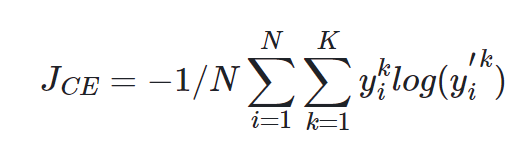
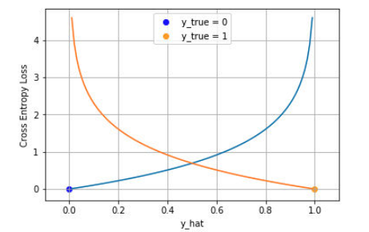
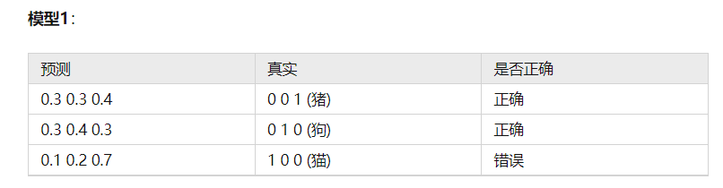
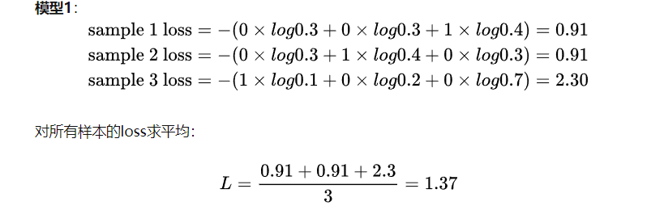

# cross-entropy with sigmod/softmax
广义上的交叉熵的计算方法是：  
  
理解上来说就是p_real*log(p_pred)的求和。  
对于sigmoid系列任务来说，有多种情况：
1. 单个严格二分类任务。即p_real中的real取值为0或者1，此时用cross_entropy的话，若p_real(0)=0且p_real(1)=1，那么ce就是log(p_pred)；若p_real(0)=1且p_real(1)=0，那么ce为log(1-p_pred)，其中p_pred为预测样本为1的概率。**总结而言，该情况下真实样本label为1的话，就是log(p)，p越大损失越小；真实样本label为0的话，就是log(1-p)，p越小损失越小。**
2. 单个非严格二分类任务。即p_real确实是一个概率而非严格的互斥0-1，如取A为0.8，取B为0.2，那么在计算ce时就要严格按照0.8log(p)+0.2log(1-p)，其中p是预测A的概率。严格二分类任务算当前情况的特例，即概率A=1.0 B=0.0。
3. 多个严格二分类任务。即存在多个二分类任务，logits和label都是[batch, N]，即存在N个二分类任务，每个分类任务之间没有数值关系。而对于每个分类任务而言，label要么是0要么是1，即N个类似的情况1的损失函数。
4. 多个非严格的二分类任务。存在N个分类任务，每个分类任务的label不是绝对的1-0，而是一个二分类的概率分布。

严格二分类的任务的情况下，真实样本为1就是log(p)，真实样本为0就是log(1-p)，如图所示：  
  

对于softmax来说，仅存在两个情况：
1. 严格的多分类任务。即真实只有一个true label，按照原始公式计算时，其他位置的p_real=0，而仅一个位置p_real=1，所以ce就是log(p_pred) p_pred代表真实label位置的概率值；
2. 非严格的多分类任务。即真实的label是一个分布，此时就严格按照原始公式计算，所有位置的p_real*log(p_pred)求和。

严格多分类情况的样例：  
  
