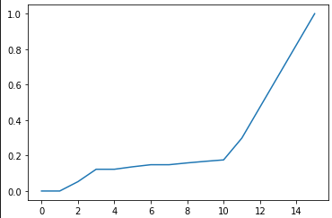
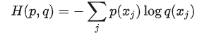

# loss functions 损失函数
- [loss functions 损失函数](#loss-functions-损失函数)
  - [回归任务](#回归任务)
    - [MSE L2 Loss](#mse-l2-loss)
      - [MSE-直接计算](#mse-直接计算)
      - [MSE-归一化计算](#mse-归一化计算)
    - [MAE L1 Loss](#mae-l1-loss)
    - [binary cross entropy](#binary-cross-entropy)
  - [通用技巧](#通用技巧)
    - [高估/低估施加权重 (分位数损失)](#高估低估施加权重-分位数损失)
    - [margin loss](#margin-loss)

## 回归任务
### MSE L2 Loss
MSE又称L2 Loss，是回归任务中使用最为广泛的损失函数。  
MSE直接以预测值与真实值的差值的平方作为损失值，计算公式如下：  
  
MSE的梯度也非常直接，即以预测值与真实值之差作为梯度的数值，这样就使得在预测值原理真实值时梯度大，利于收敛；而在预测值靠近真实值时梯度小，容易找到最优值。  
MSE的具体实践方法一般分为直接计算和归一化后计算两种。

#### MSE-直接计算
对于回归任务而言，数值的分布可以非常广泛，若样本的取值范围是[min_value, max_value]区间内，模型预测结果也是[min_value, max_value]区间内，则可以使用直接计算的方式进行MSE损失的计算。  
但是往往这种方法对于深度学习并不友好，在取值范围过大时模型的拟合能力会受到伤害。  
#### MSE-归一化计算
对于神经网络而言，很多情况下希望网络参数是简单稀疏的，而简单稀疏的网络输出结果往往比较简单，数值比较小；另外sigmoid，tanh等激活函数能够合适地将模型网络的输出数值固定在一个较小的区间内。那么在使用MSE损失时，往往需要把真实样本归一化到一个较小的区间内进行计算。  
**在实践中部分回归问题存在有界的取值空间[min_value, max_value]，此时可以直接对样本进行min_max归一化**，将数值固定在[0, 1]或者[-1, 1]的区间内，而模型网络可以使用sigmoid或tanh激活，固定到对应的区间内去做MSE损失。  
**若回归问题不存在有界的取值空间，那么往往可以采取的措施是限制取值空间后进行归一化**。例如可以将数据固定在[0, e^12]范围内，而后取log(1+x)归一化将数值固定在[0, 12]范围内，之后在除以12将数值固定在[0, 1]范围内，而后网络经过sigmoid输出的结果做MSE损失。  
**取log的方法十分适用于样本取值范围极大且可能存在长尾的场景中，在该场景中若直接使用min-max归一化会使得数值过于偏向小值，降低拟合效果，而取log之后会显著缓解该情况。**
```python
def normliaze(data, min_value, max_value):
    """
    min_max归一化
    """
    res = []
    for each in data:
        each_res = (each-min_value)/(max_value-min_value)
        res.append(each_res)
    return res
test_data = [1, 1, 2, 5, 5, 6, 7, 7, 8, 9, 10, 50, 500, 5000, 50000, 500000]
log_test_data = [np.log(data) for data in test_data]
# 对test_data和log_test_data实现min_max归一化
```
在对上述test_data和取log后的test_data进行min_max归一化时，结果如下：  
   
在直接进行归一化时，数值较小的数据被压缩在了极小的范围内，导致很难进行拟合；而取log之后该情况大大减弱。  
总结而言，使用MSE作为损失函数时，进行归一化处理往往十分合适，并且在数据取值范围很大，存在长尾情况时，可以使用取log的方式进行处理，缓解不良情况。  

### MAE L1 Loss
在回归任务中，L1损失是最为直接的损失函数。L1 Loss直接以预测值与真实值的差值绝对值作为损失函数值。  
  
使用L1损失时梯度十分固定，就是数值1。相较于MSE而言，其无法根据距离最优值的距离而动态改变梯度值，收敛性不如MSE。**但是L1在计算损失时，使用的是预测值与真实值的差值，相较于MSE使用差值的平方，L1损失受到异常值的影响更小，更具有鲁棒性**。具体理解上而言，若真实样本出现一个异常的离群值时，MSE受到的影响远大于L1，导致损失值大于L1，为了拟合这个情况，MSE的拟合曲线会被带跑更多，所以L1损失的鲁棒性更强。  

### binary cross entropy
二分类交叉熵损失也可以用来作为回归任务的损失函数，二分类交叉熵损失的公式如下：  
  
**在回归任务中，若将true label归一化到[0, 1]范围内，那么这个值可以看做概率值，即为二分类交叉熵损失中的p_real，而预测值用sigmoid激活到[0, 1]区间范围内，即为二分类交叉熵中的概率预测值p_pred，最终即可通过二分类交叉熵损失进行更新。**


## 通用技巧
### 高估/低估施加权重 (分位数损失)
分位数回归是一种拟合方法 当我们要拟合的重点在不同的分位数点的时候 比如要拟合的重点在0.7分位数那里 就需要分位数拟合  
通常的回归算法拟合的是中位数或者期望值 而分位数拟合可以给定不同的中位数 去拟合不同的分位数  
分位数回归使用的是分位数损失:
  
分位数损失设定了分位数系数r 当预测值大于真实值即高估(第一项) 其权重为(1-r) 当预测值小于真实值即低估(第一项) 其权重为(r)  
当r>0.5那么就是高估惩罚更少 而低估惩罚更多 所以允许高估 这样就拟合到了更高的分位数上  
当r<0.5那么就是高估惩罚更多 而低估惩罚更少 所以允许低估 这样就拟合到了更低的分位数上  
当r=0.5 那么就是高估低估惩罚一样 不想高估也不想低估 那么就拟合中位数 成了MAE LOSS  
**在实际操作中，可以直接将预测值大于真实值的部分设定权重值，预测值小于真实部分设定权重值。使用类似tf.where的方法进行处理**

### margin loss