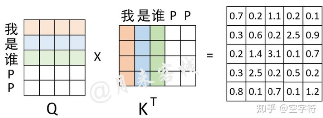
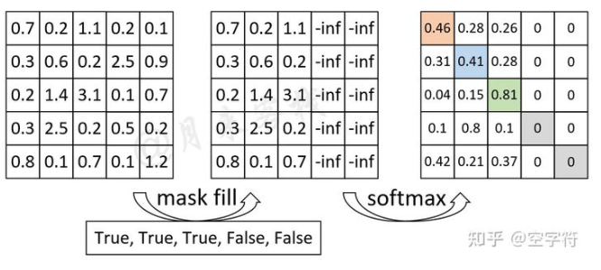
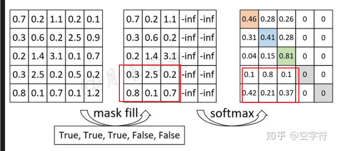
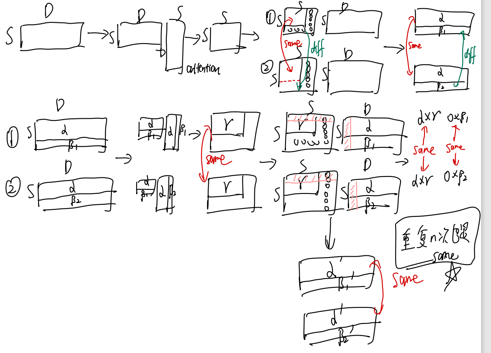
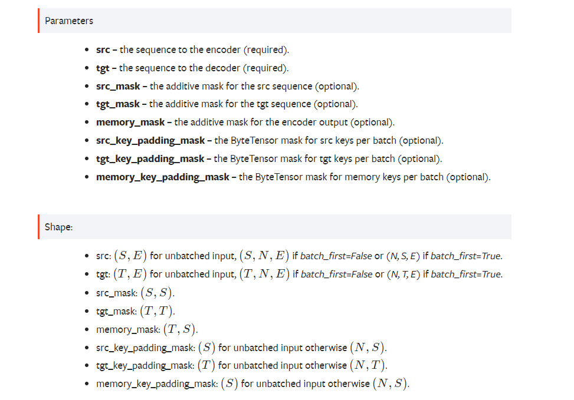
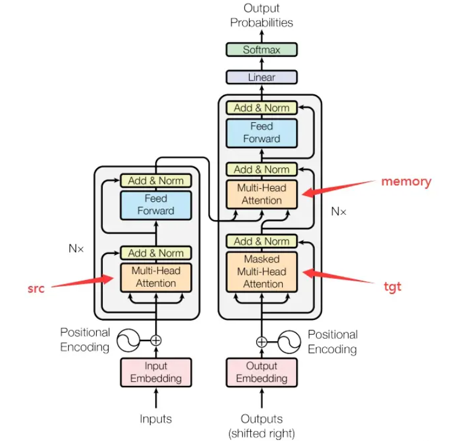

# mask
mask往往用于在矩阵运算过程中掩盖掉一些不能参与计算的地方。
pytorch中往往使用masked_fill方法进行实现，见[masked_fill api](https://pytorch.org/docs/1.11/generated/torch.Tensor.masked_fill_.html?highlight=masked_fill#torch.Tensor.masked_fill_)  
第一个参数为mask矩阵，要求BoolTensor，**其中True为需要mask的地方；另外，mask矩阵需要和被mask的矩阵满足广播条件**。  
第二个参数为value，即mask位置需要赋予的值，如果后续使用softmax函数，则往往是一个巨小值如-1e9等。  

## attention中的pad mask
pad mask往往是为了将具有seq_len的一个样本，扩展到max_seq_len上，能够作为一个batch进行计算。  
此时需要为其在不足的序列长度上添加pad token。  
而在attention计算中，就存在mask的使用。  
### pad mask的理解
加入一个self-attention操作，max_seq_len=5，而一个文本只有3，则需要将其mask至5进行计算。  
  
如上图，计算了query和key 得到了attention_score，  
而此时不能对其直接softmax，因为存在不要考虑的pad部分，需要将其mask掉。  
每一行对应一个seq位置，而五列则是对于五个位置的考虑程度，此时需要mask最右侧两列  
  
这样在做softmax的时候，就不会考虑后面两个pad token。  

此时有一个问题，红色框部分要不要变为-inf和0  
  
在下面这个推导中，可以得出的结论是，红框mask与不mask对前三个有意义的位置没有任何影响，而对于seq_len上最后的pad位置，则完全不一样。  
  
需要注意的是，上图推导中，最为重要的部分就是由于softmax将值变为0，而导致了有意义的部分两种操作的结果完全相同。  
### pad mask的实现与广播
见[mask代码](mask.ipynb)  

## attention中的attention mask
除了pad mask外，attention中存在直接给注意力值矩阵mask的需求。  
例如transformer decoder端要进行预测时，seq=1的位置不能看到seq=2...n的位置信息，即attention值就应该是0，此时需要attention mask。  

## transformer中的各种mask
在transformer的api中存在六种mask情况。  
  
分为两类：mask和key_padding_mask；同时有三种情况 src, tgt和memory。  
**其中mask代表直接对attention位置上的遮盖，key_padding_mask表示了对序列中pad部分的遮盖。**  
**src表示encoder部分的self-attention；tgt表示decoder部分的self-attention；memory表示decoder部分的cross-attention。**  
  
具体的解释：
1. src_mask。 src_mask维度是[seq_len_in, seq_len_in]，在encoder部分做self-attention时，attention_score的维度为[batch, seq_len_in, seq_len_in]，而src_mask则直接是对其进行掩盖。  
直接理解：对于batch里每个样本一视同仁，对于一个位置i，对任何一个位置考虑或者不考虑，不考虑就要mask掉。将这种mask效果广播到每个样本上。  
适用场景：目前没有遇到
2. tgt_mask。tgt_mask维度是[seq_len_out, seq_len_out]，在decoder部分做self-attention时，attention_score维度为[batch, seq_len_out, seq_len_out]，而tgt_mask直接对其进行遮盖。  
直接理解：对于decoder batch中的每个样本一视同仁，对于一个位置i，对任何一个位置考虑或者不考虑，不考虑就要mask掉。将这种mask效果广播到每个样本上。
适用场景：在decoder端进行推理是，i位置仅能考虑之前的情况，而对于i+1...位置的信息不能考虑，但是由于是矩阵运算而已经计算过了，那么需要mask掉，是一个景点的上三角矩阵。  
3. memory_mask。memory_mask维度是[seq_len_out, seq_len_in]，在decoder部分做cross-attention时，attention_score维度为[batch, seq_len_out, seq_len_inn]，memory_mask直接对其遮盖。  
直接理解：对于cross-attention过程，decoder不考虑encoder部分位置，对这些地方进行mask，所有样本一模一样。将这样的效果广播在每个样本上。  
适用场景：目前没有遇到
4. src_key_padding_mask。src_key_padding_mask维度是[batch, seq_len_in]，encoder部分每个样本的序列长度都为max_seq_len，而不够的则用pad token进行补充至序列长度，再计算attention时，不应考虑这些位置。  
直接理解：attention维度为[batch, seq_len_in, seq_len_in]，这个mask的作用在第一维和最后一维，对中间这个维度进行广播。表示对每个位置而言，不考虑的位置都一样，都是pad的位置，而样本间则不一样，有的考虑多有的考虑少。  
适用场景：encoder的序列有pad时
5. tgt_key_padding_mask。tgt_key_padding_mask维度是[batch, seq_len_out]，decoder部分每个样本的序列长度都为max_seq_len，而不够的则用pad token进行补充至序列长度，再计算attention时，不应考虑这些位置。  
直接理解：attention维度为[batch, seq_len_out, seq_len_out]，这个mask的作用在第一维和最后一维，对中间这个维度进行广播。表示对每个位置而言，不考虑的位置都一样，都是pad的位置，而样本间则不一样，有的考虑多有的考虑少。
适用场景：decoder的序列有pad时
6. memory_key_padding_mask。memory_key_padding_mask的维度是[batch, seq_len_in]，在cross-attention时，矩阵维度为[batch, seq_len_out, seq_len_in]，对该过程进行mask
直接理解：cross-attention表示的是对decoder的每个位置，encoder的各个位置的注意力值是多少，而encoder的各个部分有可能是pad token的embedding值，不需要进行考虑，所以对其进行mask。维度和第一维、最后一维相同，而在第二维广播，表示对每个位置而言，pad的情况都一样，但是在样本间是不一样的。  
适用场景：encoder的序列有pad，且cross-attention不考虑pad的情况时  
目前认为memory_key_padding_mask和src_key_padding_mask一模一样。  

