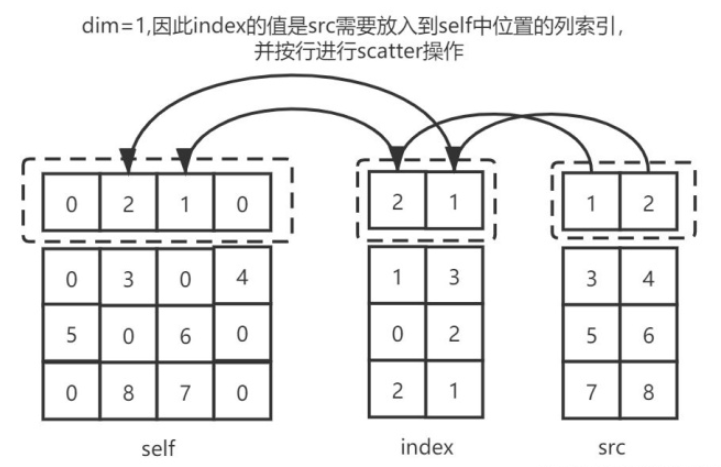
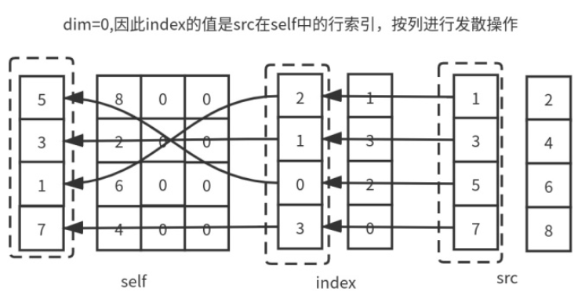
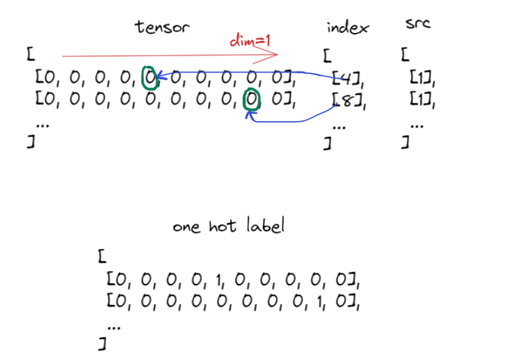
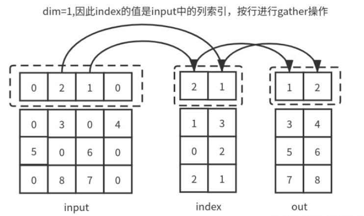
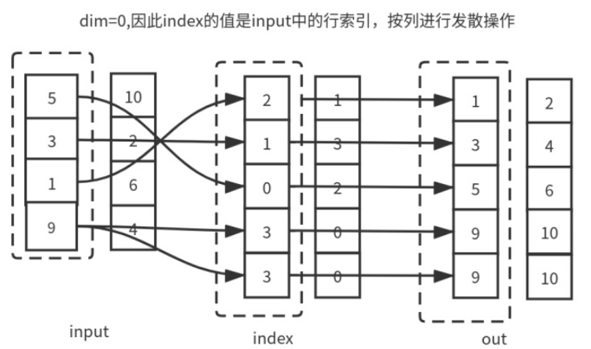

# scatter和gather
scatter(数据发散) gather(数据聚集)。  
在pytorch、tensorflow乃至Paddle等框架中均实现了scatter和gather功能，该方法相对比较小众但是很有用。  
以pytorch说明两种方法，框架中的实现基本一致。  
## scatter
'''
scatter_(dim, index, src) -> Tensor
'''
scatter_ api所实现的功能是：将src矩阵中的部分值，以dim为轴，按照index索引，填充至当前矩阵中。  
scatter即为根据index将src按照dim填充为self  
要求有三点：
1. 调用的张量本身、index、src三个对象的维度个数必须一致，即都是3维、2维等；
2. 在每一个维度d上，index的维度值要小于等于src的维度值 index.size(d) <= src.size(d)；
3. 在每一个维度d上，如果d!=dim，index的维度值要小于等于当前tensor的维度值，index.size(d) <= self.size(d)；
4. index中的数值一定要在[0, self.size(dim)-1]闭区间，使得index位置有意义

### 个人理解
对self tensor进行填充，填充位置由index决定，填充的值由src决定，填充过程由dim维度决定。  
1. 对于以dim为轴看index，若dim=0就列向查看数行，dim=1就行向查看数列。
2. index数值中按顺序是各个填充的位置，
3. 找到填充位置后，将src上相同位置的值填充上去。

### 样例
  
1. 由于dim=1 那么就按照一行一行顺序看，第0行对应结果的第0行，第i行对应结果第i列；
2. index中每一行中，每一列上的值代表填充的列位置数值，
3. 而src上完全相同位置上的值，代表填充的数值

图中，index的第一行值代表self第一行填充情况，2与1代表第2列与第1列，填充值分别是1和2，  
第二行中1和3代表索引位置是第1列与第3列，值为3和4。  
最终全部填充完毕  

  
图中，index的第一列表示self第一列的填充情况，2,1,0,3均为行索引，数值为1，3，5，7  

  
scatter 常被用在one-hot的实现中，对于batch中每个样本，填充index位置为1，则dim一定是1，每个样本进行操作。  

### 代码
上述三个样例的实现代码见[scatter_gather](scatter_gather.ipynb)  

## gather
'''
torch.gather(input, dim, index, out=None, sparse_gard=False) -> Tensor
'''
**gather是scatter的逆操作，scatter是填充根据index将src按照dim填充为self，那么gather就是根据input和index按照dim轴求src**  
gather操作按照index的索引位置，去获取input中的值，构建和index一直的结果  
要求有三个：
1. 对于所有d!=dim，必须有input.size(d)==index.size(d)，对于维度d==dim而言，必须有index.size(dim) >=1；
2. 结果out和index维度完全相同
3. index中的索引值要在input.size(dim)范围内

### 个人理解
输出结果和index维度相同，每个位置按照index的值找input中的对应位置即可  

### 样例
  
1. 由于dim=1，索引值都为dim=1的数值，那么就按照一行一行看；
2. 对于第一行，取列形索引，对应位置为第2列和第1列
3. 值为1和2 分别填入out的第一列和第二列上

  
1. 由于dim=0，索引值为dim=0的数值，按照一列一列看；
2. 对于第一列，取行形索引
3. 填入得到的数值在index的对应位置